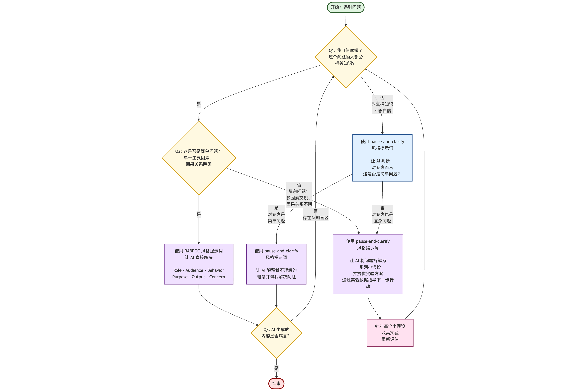

# 相伴AI应对未知问题的"概念-假设-实验"策略图

## 1. 痛点

有了 AI 加持，人们可以应对之前未知的问题，比如后端工程师开始编写前端代码。但未知问题的难度如何？该如何与 AI 协作应对未知问题？

## 2. 解决方案

与 AI 协作应对未知问题的"概念-假设-实验"（Concept-Hypothesis-Experiment）策略图。该策略图为人们提供了一个与 AI 协作应对未知问题的框架。

该策略图的核心思想是：根据问题的复杂程度和自己对相关知识的掌握程度，选择不同的 AI 协作方式。对于简单问题，可以直接使用 RABPOC 风格提示词让 AI 解决；对于复杂问题或自己知识不足的问题，使用 pause-and-clarify 风格提示词，让 AI 将问题拆解为一系列小假设，并提供实验方案，通过实验数据指导下一步行动。

## 3. 实例

以后端工程师使用 AI 开发并在云服务器上部署 AI 智能体 Web 应用相关问题的解决过程为例，详细描述该策略图的实际应用过程：

### 实例1：找出 2025 年国内出版的 3 本热门氛围编程书

这是一个我自信掌握了大部分相关知识的简单问题，直接用 RABPOC 风格提示词（参见伍斌的《氛围编程》泡泡书第7章）让 AI 解决。

### 实例2：生成 AI 智能体应用心得的 PPT 大纲

虽然我自信掌握了起草 PPT 大纲的大部分知识，但这个大纲能否吸引听众是个复杂问题。于是我使用 pause-and-clarify 风格提示词（RABPOC + RIPER-5，参见 gitee.com/wubin28/pause-and-clarify-prompts），让 AI 把问题拆解为一系列小假设，并提供实验方案，通过实验数据指导下一步行动。

### 实例3：在本地电脑上运行使用不熟悉的技术栈开发的智能体

这是专家眼中的简单问题，因为AI能访问我的电脑上的代码。我使用 pause-and-clarify 风格提示词让 AI 解释我不理解的概念，并帮我在本地电脑运行这个智能体。

### 实例4：将智能体部署到云服务器上

云服务器的环境（如具体的配置信息和出错信息）对我和 AI 都是未知的，这是对专家来说也复杂的问题。我使用 pause-and-clarify 风格提示词，让 AI 将问题拆解为一系列小假设，并提供实验方案，通过实验数据指导下一步行动，最终成功在云服务器上部署和运行了这个智能体。

## 策略图

