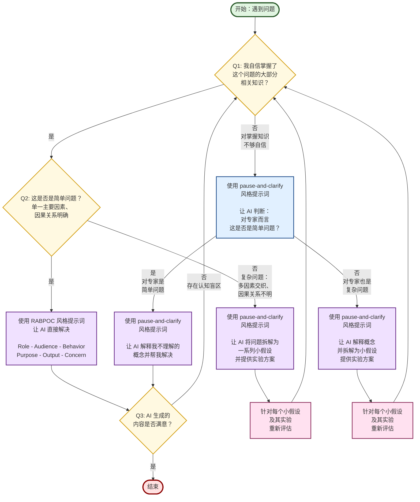

## Me:

```
请用mermaid脚本可视化下面的策略：## 相伴AI应对未知问题的“概念-假设-实验”（Concept-Hypothesis-Experiment）策略

Q1: 我自信掌握了这个问题的大部分相关知识？
	是 → 
		Q2: 这是否是简单问题（单一主要因素、因果关系明确）？
			是 → 
				用 RABPOC 风格提示词 (Role-Audience-Behavior-Purpose-Output-Concern)让 AI 直接解决
					Q3: AI 生成的内容是否满意？
						是 → 
							结束
						否（说明我对某些方面存在认知盲区）→ 返回 Q1
			否（复杂问题：多因素交织、因果关系不明）→ 
				用 pause-and-clarify 风格提示词让 AI 将复杂问题拆解为一系列小假设，并提供各假设的实验方案，通过实验数据指导下一步行动 → 针对每一个小假设及其实验，返回 Q1
	否（对于掌握这个问题的大部分相关知识我不够自信）→
		用 pause-and-clarify 风格提示词让 AI 判断：对相关领域专家而言，这是否是简单问题（单一主要因素、因果关系明确）？
			是 → 
				用 pause-and-clarify 风格提示词让 AI 解释我不理解的概念并帮我解决 → 返回 Q3
			否（AI 判断这对专家而言也是复杂问题：多因素交织、因果关系不明）→
				用 pause-and-clarify 风格提示词让 AI 解释我不理解的概念，并将复杂问题拆解为一系列小假设，提供各假设的实验方案，通过实验数据指导下一步行动 → 针对每一个小假设及其实验，返回 Q1
```

## Claude app with sonnet 4.5:

```
我来为你创建这个决策流程的Mermaid可视化图：



这个Mermaid流程图的关键特点：

**节点类型说明：**
- 🟢 **绿色**：起点和终点
- 🟡 **黄色菱形**：关键决策点（Q1, Q2, Q3）
- 🔵 **蓝色矩形**：AI判断节点
- 🟣 **紫色矩形**：行动节点（RABPOC、pause-and-clarify）
- 🔴 **粉色矩形**：循环回归点

**核心逻辑：**
1. **自信 + 简单** → RABPOC直接解决
2. **自信 + 复杂** → 拆解假设 + 实验
3. **不自信 + 专家认为简单** → 学习概念后解决
4. **不自信 + 专家认为复杂** → 学习概念 + 拆解假设

这个策略体现了**概念-假设-实验**的科学方法论，在AI协作中的应用。
```